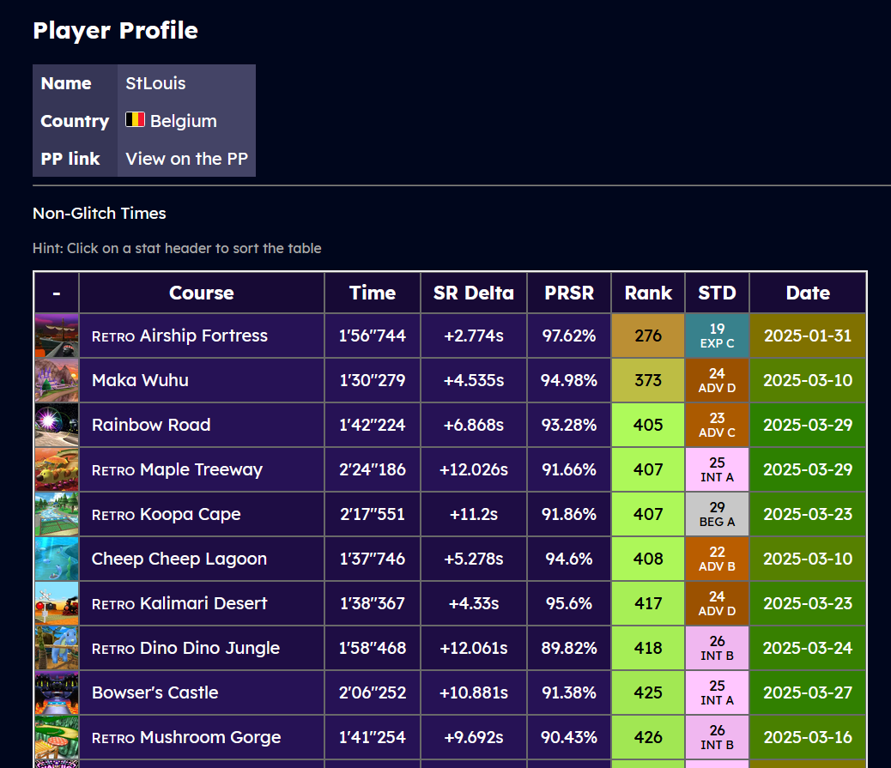

# MK7 PP Deluxe

A modern and improved look for the Mario Kart 7 Player's Page

## Features

- Inividual player profiles
- Leaderboards (AF)

## WIP (coming soon)

- Course leaderboards

## Run locally

Firstly copy `.env.example` to `.env` and fill it with a secret key. 
Then configure `config.py` as well as `gunicorn_config.py`.

Install dependencies : `pip install -r requirements.txt`

For caching, you can use Redis. Configure the client in `config.py` or disable it. 
There is an example `docker-compose.yml` for Redis in `redis-example`.

Then run using `gunicorn --config gunicorn_config.py app:app`

The app will by default be available on port `11130`.
